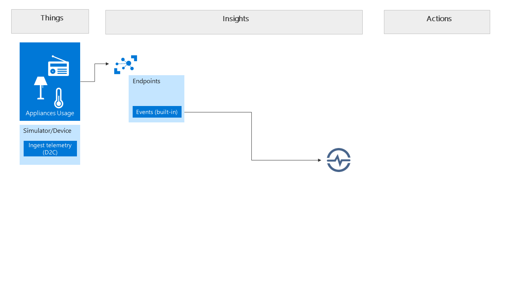

# Azure IoT WS - Part 1

> In this section we will create an Azure IoT Hub, Time Series Insights and setup ingestion from a device simulator.

### Create Azure resources

1. Create a new Resource Group. We recommend giving it a clear prefix like `initials-datedigits`. For example `kdg-10247`.
1. Create an Azure IoT Hub - choose Free tier if you don't have one already in your subscription (only one Free allowed). Choose S1 if you cannot create a free one. You can use the default settings.
1. Create a Time Series Insights account
1. Once your IoT Hub is created, go to Endpoints > Built-in Endpoints > Events. 
    1. Add a consumer group name `timeseries`.
1. Add a device to your IoT Hub. You can use the Device Explorer pane in the IoT Hub. 
    Optional: use IoT Hub ***Device Explorer*** tool (see pre-requisites) or the CLI tool ***iothub-explorer*** to create your device instead.
1. Go to your Time Series account. Add a data source to consume data from the IoT Hub, and make sure to use the `timeseries` consumer group.

### The simulator for ingestion of telemetry

1. Leverage a simulator to ingest sensor telemetry into IoT Hub. You have two options:
    1. Option A: leverage an online simulator and tools
    1. Option B: leverage a smart meter simulator and agent console (see further below)

#### Option A: online simulator and tools
1. Manually register a new device in your IoT Hub: go to Device Explorer and add a new device. Take note of the device's connection string.
1. Use the Raspberry Pi online simulator for this if you like: 
[https://docs.microsoft.com/en-us/azure/iot-hub/iot-hub-raspberry-pi-web-simulator-get-started](https://docs.microsoft.com/en-us/azure/iot-hub/iot-hub-raspberry-pi-web-simulator-get-started)
1. Enter the connection string to your newly created device (copy the connection string from the device's properties screen in the Azure Portal)
1. Change the Telemetry message the simulator is sending to the cloud and add a field named `consumption` with a random value to the Message. 
1. Run the simulator and validate the message sent contains a consumption value. Keep it running for a few minutes to get some data in your IoT Hub.

#### Option B: Smart meter and agent console
1. Clone the repository [https://github.com/lucarv/iotcloudworkshop](https://github.com/lucarv/iotcloudworkshop).
1. Browse the newly cloned directory `iotcloudworkshop` and browse to subdirectory `facit`, which contains the completed solution.
1. In this directory you'll find two sub-directories:
    1. `metersimulator` is a smart meter simulator application to be used as sample.
    1. `serviceportal` is a console for the service agent to be used later
1. For now, browse to the `metersimulator` and open this folder in Visual Studio Code. 
1. Using a command line terminal, or within the Integrated Terminal in Visual Studio Code, start up the application by
    1. Run `npm install` to install the node packages
    1. Run `npm start` to start the application
    1. Browse to [http://localhost:3300/](http://localhost:3300/)
    1. Register a new device on the first screen. Add a unique name and enter the connection string to the IoT Hub. This can be found in the Azure Portal, under Shared access policies. Use the iothubowner policy.
    1. Once the device is registered, go Telemetry tab and start a 'Stream' telemetry. This will start sending messages to the IoT Hub. 
    1. After a few minutes you can click Stop tele.

### End result
1. After ingesting telemetry you should be able to dive into the telemetry data using your Time Series Insights account.
1. Open your Time Series account and review.

### Other parts in this lab

1. [Part 2](part2.md)
1. [Part 3](part3.md)
1. [Part 4](part4.md)
