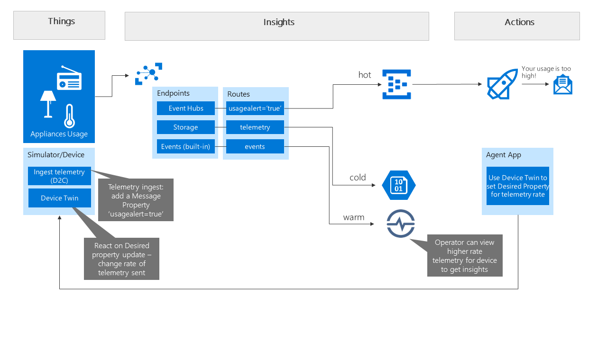

# Azure IoT WS - Part 3

> In this lab we will add an route to Event Hubs upon a rule that acts on alerts from the device. Once in Event Hubs we add a logic app to trigger and send a mail to the customer alerting her of high usage. We also use Device Twins to change the ingest rate for telemetry.

### Add Event Hubs and route

1. Create a new Event Hub service in your Resource Group.
1. Add an event hub to the service.
1. In the IoT Hub, add an Endpoint to the Event Hub you created above.
1. Add a Route to the endpoint, add a condition to route messages with following querystring `usagealert='true'`.

### Simulator to send a property in the telemetry message

1. Leverage the Raspberry online simulator [https://azure-samples.github.io/raspberry-pi-web-simulator/](https://azure-samples.github.io/raspberry-pi-web-simulator/).
1. Add a Message *property* `usagealert` with a value of `true` to a random or calculated message. 
_Note: Message properties are strings, so your condition needs to match to a string value._
    1. Hint: change the `sendMessage` function to add a new property.
    1. `message.properties.add('usagealert', 'true');`
1. Run the simulator to ingest telemetry. Make sure one of the messages triggers the property to be added to one or more messages (randomness).
1. Validate the Event Hub is receiving messages that match the condition. This should validate your route is working.
    1. Event Hubs in the Portal will show the amount of messages coming in, if you want to see messages coming through you can leverage Visul Studio Code with the [Event Hub Explorer](https://marketplace.visualstudio.com/items?itemName=Summer.azure-event-hub-explorer) extension.

### Add a Logic App to alert customer

1. Create a new Logic app.
1. Add a Trigger for messages coming from an Event Hub.
1. Select your Event Hub (you'll need to go to advanced properties to add a Consumer group name if you created one).
1. By default the trigger will look for new messages every 3 minutes. During dev you can put this to 1 minute.
1. Add an action to send e-mail via Office 365 or another connector of your choice.
1. For the receiver, enter your own e-mail address (static value).
1. For the message body, you can leverage the Dynamic content from the previous step. To retrieve the Message's body, use `[Content]` Dynamic property. Note: if you want to parse the Json you can add a step before this action to Parse JSON. For this you will need the schema of the message.
    1. Additionally the Message body is encoded so to parse the JSON you will need to go into code view of the logic app, and use the following expression in the Content field: `@{base64ToString(triggerBody()?['ContentData'])}`.
1. Enable the Logic App.
1. Run the Trigger. If there are messages in the Event Hub it should fire the trigger. You can verify runs by viewing the Trigger History. You should now get an e-mail in your inbox. 
1. Note: you might want to disable the Logic App to stop receiving e-mails.

### Device Twins

We'll use a device twin to change the rate on which telemetry messages are sent to the cloud.

1. Use Device Explorer tool or the Azure Portal's device explorer to set the telemetry rate property. Use the Desired property for this.
1. In the Online simulator app, react to Device Twin change event and adapt the telemetry send rate to the value received. Hint: get some insights on Device Twins [here](https://docs.microsoft.com/en-us/azure/iot-hub/iot-hub-node-node-twin-how-to-configure).
1. Once the rate goes up, you should be able to see values at higher rate coming into Time Series Insights (Scenario is an operator will be able to dive into much more granular info).
1. Optional: use the Desired property again to set the rate back to every 10 seconds for example.

### End result 
1. You have received an e-mail with a warning from the Logic App.
1. Review the telemetry coming into Time Series Insights.
1. You should now see higher frequency telemetry.

### Optional: make it more real with a customer's e-mail address

You could leverage a custom function or Stream Analytics with reference data containing Customer information. Create a new Event with a message body that contains the customer e-mail and only then get the Logic App to run. In this case you can keep the Route's condition but you might be sending it to an Azure Function first instead of directly to the Logic App.

### Other parts in this lab

1. [Part 1](part1.md)
1. [Part 2](part2.md)
1. [Part 4](part4.md)